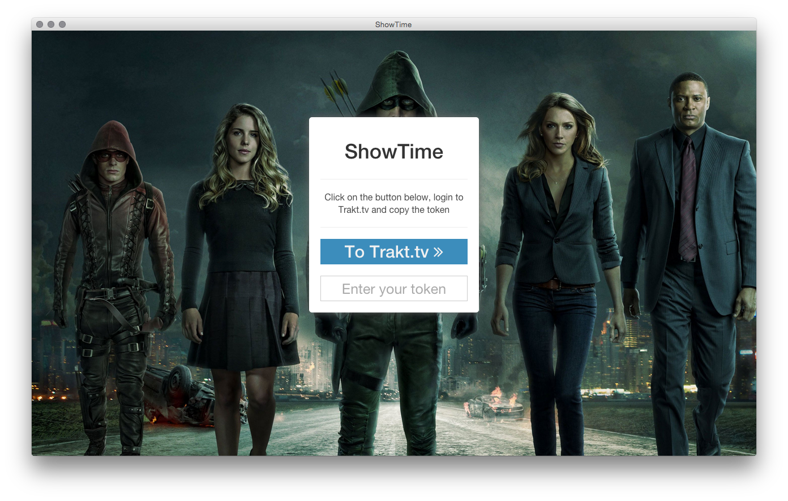
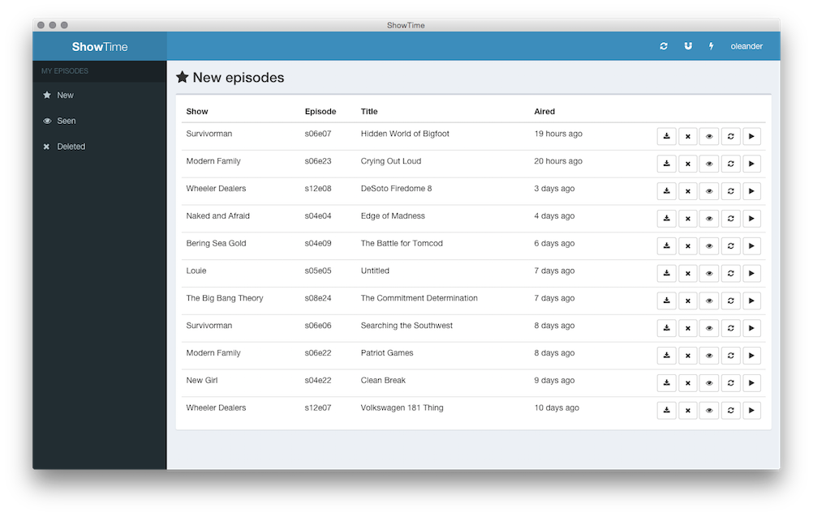

# ShowTime

A torrent desktop client for [Trakt.tv](http://trakt.tv) with live updates from [thepiratebay.org](http://thepiratebay.se/) and [Popcorn-Time](http://popcorntime.io/) integration.

## Screenshots

### Login screen

### Dashboard

## Functionality

- Runs in the background and notifies you about new episodes / releases
- Play episodes directly in [Popcorn-Time](http://popcorntime.io/)
- Mark seen episodes

## Pre-compiled binaries

Visit the [release page](https://github.com/oleander/git-fame-rb/releases) for pre-compiled binaries.

## Development

1. Add your own trakt.tv credentials into `config.copy.json` and movie it to `config.json`. You'll find your credentials [on the settings page](http://trakt.tv/oauth/applications)
2. Install dependencies using `npm install`
3. Start ember using `ember server`
4. Start Electron (the GUI) using `./start`

## Deploy

Run `./deploy` to create a runnable binary. Note that I only support OS X at the moment, but PR are welcome.